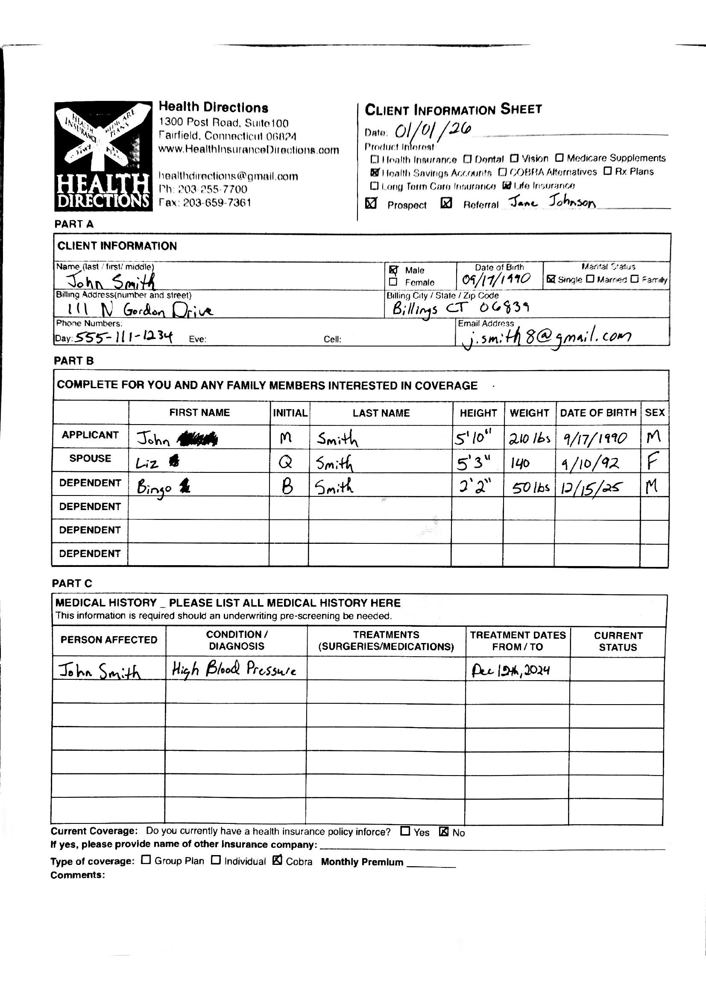

# Document Processing → Structured Data

## About the project

The goal of this project is to demonstrate the current state of using AI (GPT-5.2) to parse documents into structured data, and how traditional engineering techniques can be used to assist the model and significantly improve accuracy. This is not production level code, but rather a demo.

### Example Document

### Current State of AI

AI continues to improve at parsing documents into structured data, but it is not—and may never be—100% reliable on its own. This project examines a real-world document processing pipeline using a deliberately challenging input: a complex form scanned with a phone camera rather than a clean, synthetic example.

The notebook begins by evaluating the accuracy of GPT-5.2 when used alone to parse the document into structured data.

### Combining AI with Traditional CV2/OCR

During testing, it was discovered that the **Product Interest** section was incorrect more often than it was correct. For the (hypothetical) business ingesting this document, this represents a critical failure point, as downstream workflows depend on that data being accurate.

To address this, the notebook explores how traditional techniques—such as box detection, checkmark/X detection, and OCR-based label context—can be used to provide stronger, more deterministic context to the model, resulting in significantly improved accuracy.

## Prerequisites

To run this notebook:

1. Install Tesseact OCR
1.a. See https://tesseract-ocr.github.io/tessdoc/Installation.html
2. Install Dependencies
2.a. (Optional but suggested) Create a venv `python -m venv .venv && source .venv/bin/activate`
2.b. (Optional) Adjust `--extra-index-url https://download.pytorch.org/whl/cu126` in `requirements.txt` for your cuda version
2.c.`pip install -r ./requirements.txt`
3. Setup .env
3.a. Initialize with `OPENAI_API_KEY=**YOUR_APIKEY_HERE**` (Running the whole notebook runs 8 calls to OpenAI and at the time of creation cost about $0.07 total) 